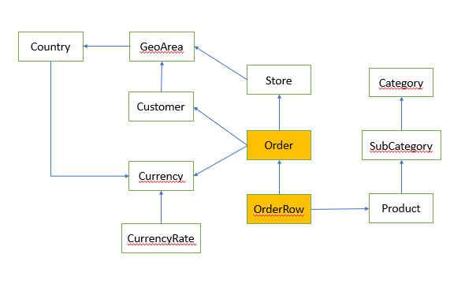

The ContosoDatamart DatabaseGenerator is a tool to generates orders for the Contoso data model in order to provide demo data.

## Overview and usage
Database Generator  is a command line application, running on .NET Core 3.1. It requires a working-folder to run on, containing a configuration file and data input files. After executing, working-folder also contains generated output data files and logs.

Usage:  `databasegenerator.exe  inputfolder  outputfolder  configfile  [param:OrdersCount=nnnnnnn]`

Input files:
- config.json : main app configuration
- data.xlsx : static data (products, categories, …) and their configuration (distribution, weights, …)
- customer.rpt : customers list

Output files:
- orders.csv
- orderRows.csv
- customerCluster.csv
- log.log

## Model

> TODO: this image does not corrspond to the tables imported in the generated Database

## Json Configuration file (config.json)

This file contains the main configuration of the data generator.
- **OrdersCount**: (int) total number of orders to be generated.

- **StartDT**: (datetime) date of the first order.

- **YearsCount**: (int) total number of years generated. Orders are distributed over the years.

- **CutDateBefore**: TO BE DOCUMENTED

- **CutDateAfter**: TO BE DOCUMENTED

- **CustomerFakeGenerator**: (int) number of fake customers. If > 0, customers.rpt file is ignored and a number of fake customers is generated.

- **DaysWeight** (section)

    - **DaysWeightConstant**: (bool) if set to true, the configuration about days is ignored.

    - **DaysWeightPoints**, **DaysWeighValues**: (double[]) points for interpolating the the curve of distribution of orders over time. It covers the entire YearsCount period.

    - **DaysWeightAddSpikes**: (bool) if set to false, annual spikes are ignored.

    - **WeekDaysFactor**: (double[] – length 7) weight multiplication factor for each days of the week. First day is Sunday.

    - **DayRandomness**: (double) percentage of randomness add to days, to avoid having a too-perfect curve over time.

- **OrderRowsWeights**: (double[]) distribution of the number of rows per order. Each element is a weight. First element is the weight of orders with one row, the second is the weight of orders with two rows and so on

- **OrderQuantityWeights**: (double[]) distribution of the quantity applied to each order row. Each element is a weight. First element is the weight of rows with quantity=1, the second element is the weight of rows with quantity=2 and so on.

- **DiscountWeights**: (double[]) distribution of the discounts applied to order rows. Each element is a weight. First element is the weight of rows with discount 0%, the second element is the weight of rows with discount 1% and so on.

- **OnlinePerCent**: TO BE DOCUMENTED

- **DeliveryDateLambdaWeights**: TO BE DOCUMENTED

- **CountryCurrency**: table mapping Country to Currency

- **AnnualSpikes**  : set of periods where orders show a spike. For each spike you define the start day, the end day and the multiplication factor.

- **OneTimeSpikes**: set of spikes with a fixed start and end date. For each spike, you define the start end, the end date and the multiplication factor.

- **CustomerActivity** : contains the configuration for customer start/end date

    - **StartDateWeightPoints**, **StartDarteWeightValues**: configuration for the spline of customer start date

    - **EndDateWeightPoints**, **EndDateWeightValues**: configuration for the spline of customer end dates

## Customers list (customers.rpt)
> TODO: the original document referred to customers.tsv

File containing customers information. Format: text, tab delimited. Only the first two columns are used by the tool: CustomerID (int) and GeoAreaID (int). Following columns are ignored.

## Excel configuration file (data.xlsx)

The Excel configuration file contains both fixed data and parameters to control the distribution of random data. For example, from here you can decide the relative percentage of orders for categories and subcategories.

The file contains several sheets, further described here. Each sheet contains multiple columns. The software reads some of the columns recognizing them by name. Columns with names that do not follow the standard requirements of the software are ignored. Columns have been conveniently colored in yellow if they are used by the software. Any non-yellow color is considered a comment and it is useful only for human purposes. 

### Categories
From here you can configure sales of categories using two curves: W and PPC. “W” define the relative weight of each category in the set of all categories for different periods in the entire timeframe. “PPC” define the variation of price of items of each category during the whole period (Price Per Cent). Normally the last column is 100%.

### Subcategories
From here you can configure sales of subcategories using a weight curve with columns marked with W. The values are used to define the weight of a subcategory inside its category. Therefore, the numbers are summed by category and then used to weight subcategories inside the category.

### Subcatlinks
In this page you can configure the likelihood that one product in a subcategory triggers the purchase of another product in another subcategory. The values are in percentage: <17, 18, 80%> means that if a product of subcategory 17 is added to an order, there is an 80% chance that a product of subcategory 18 will be added to the same order.

### Products
In this page you configure, for each product, the initial price and the distribution of sales of the product over different time periods. The weights identified in the W columns are relative to the subcategory to which the product belongs.

### CustomerClusters 
In this page we define clusters of customers. Each cluster is defined by two columns: OW (OrderWeight) and CW (CustomerWeight). Order Weight defines the percentage of orders assigned to customers belonging to the cluster, whereas CustomerWeight defines the percentage of the total customers used to fill the cluster.

It is possible to define a large cluster of customers that generates a small number of orders. The number of clusters is free.

### GeoAreas
This page is intended to define geographical areas, each with a set of weights to change the activity of the area over time. Each area is independent from the other and the definition of geographical areas need to be done at the leaf level: no grouping is provided.
For each geographic area we define the W columns to provide the activity spline.

### Stores
In this page we enumerate the stores. For each store we provide its geographical area and the open and close date. A store is active only between the two dates.
We do not provide weight activity for the stores, as the behavior is dictated by the customer clusters. A special store marked -1 as StoreID defines the online store.
Each order is assigned to either the online store or to a local store depending on the country of the customer.

### Output files

- customersClusters.csv : ClusterID, CustomerID
- orders.csv : OrderID, CustomerID, StoreID, DT  
- orderRows.csv: OrderID. RowNumber, ProductID, Quantity, Price1, Price2
- log.log
